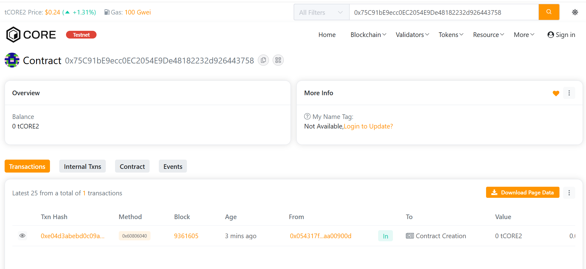

# Ledgerly

## 🧩 Project Description
**Ledgerly** is a decentralized blockchain ledger system that securely records and retrieves transactions on-chain.  
It enables transparent tracking of transfers between parties, ensuring immutability and trust without intermediaries.

---

## 🎯 Project Vision
To build a **trustless and verifiable digital ledger** that can serve as the foundation for decentralized finance, transparent accounting, and data authenticity verification.

---

## ✨ Key Features
- **Immutable Ledger:** Every transaction is permanently recorded on the blockchain.
- **Transparent Records:** Anyone can view the entire transaction history.
- **Event Logging:** All actions emit blockchain events for traceability.
- **Secure Recording:** Only valid transactions (non-zero, valid receiver) are accepted.

---

## 🔮 Future Scope
- Integrate with **ERC20 token transfers** to create a financial audit trail.
- Build a **frontend dashboard** to visualize transaction history.
- Add **role-based permissions** for enterprise use.
- Enable **IPFS integration** for large data storage alongside transaction metadata.

---

Address: 0x054317f26cf1974e6e579fbf9358bffdaa00900d

